# Enunciados de programción: 
## Ejercicio 01
### Dado un número introduccido por el usuario, que será eñ valor del diámetro de una circunferncia, sacas por pantalla el valor de la longitud de la circunferencia y el área de la circunfercia y el áre de la círculo. Usar las variables radioCir (radio), dianetroCir (diametro=¡), longitudCir (longitud), areaCir (área) y 3.14 PI 
#### a) Sin usar ningún bucle
#### b) Con bucle while
#### c) Con bucle for 

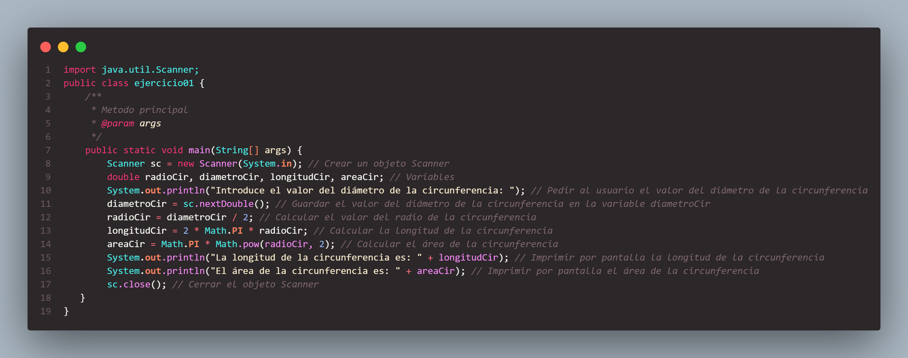
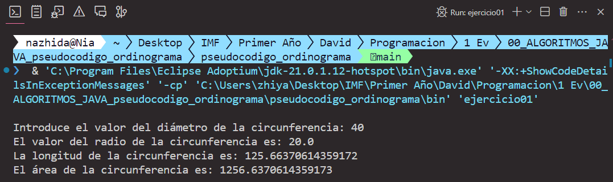 

## Ejercicio 02 
### Introducir dos números por pantalla, y decir si uno es mútliple del otro. Comprobar cúal es el múltiplo de cual, o si son iguales.
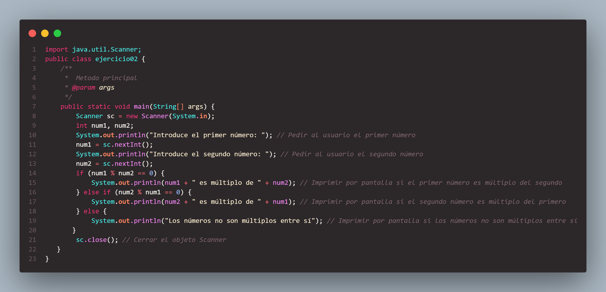
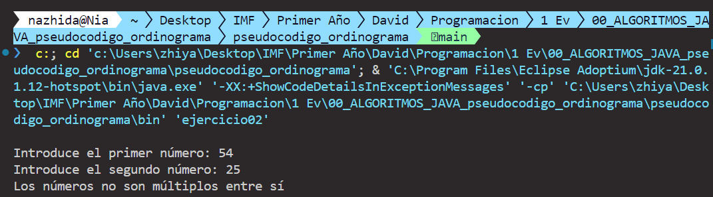

## Ejercicio 03
### Introducir un número por pantalla, y calcular si es par o impar. Hacerlo esto mismo con una serie de números. El programa finaliza, cuando introducimos un valor cero como valor del número
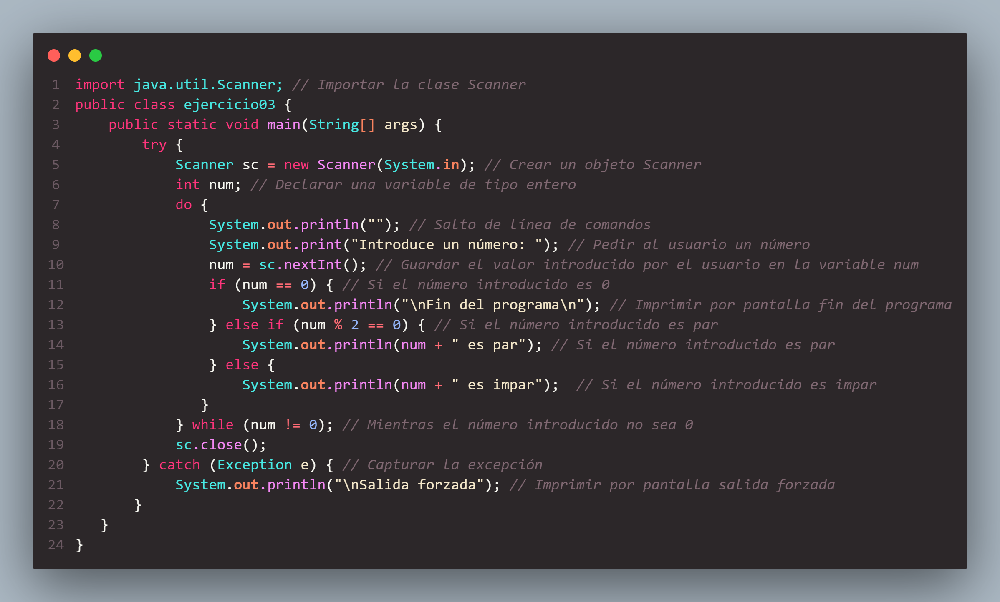
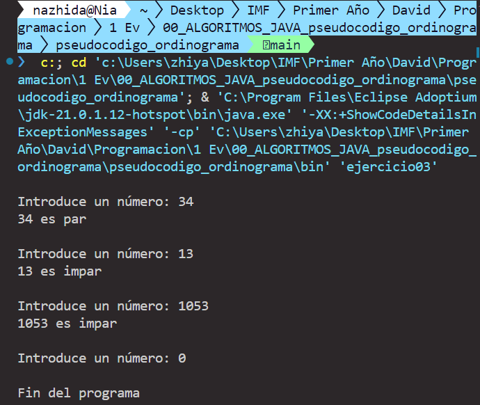  

## Ejercicio 04
### Imprimir la tabla de multiplicar de un número, siguiendo el siguiente formato,  
```math
2·1= 2 
\\
2·2= 4
\\
2·3= 6
\\
2·4= 8 
\\
2·5= 10
\\
2·6= 12
\\
2·7= 14
\\
2·8= 16
\\
2·9= 18
\\
2·10= 20
```

### Se debe controlar, que el número del que queremos motrar la tabla, sea del `1` al `10` 
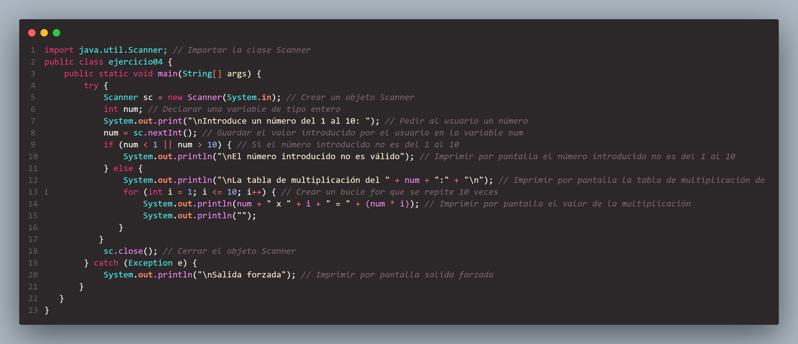
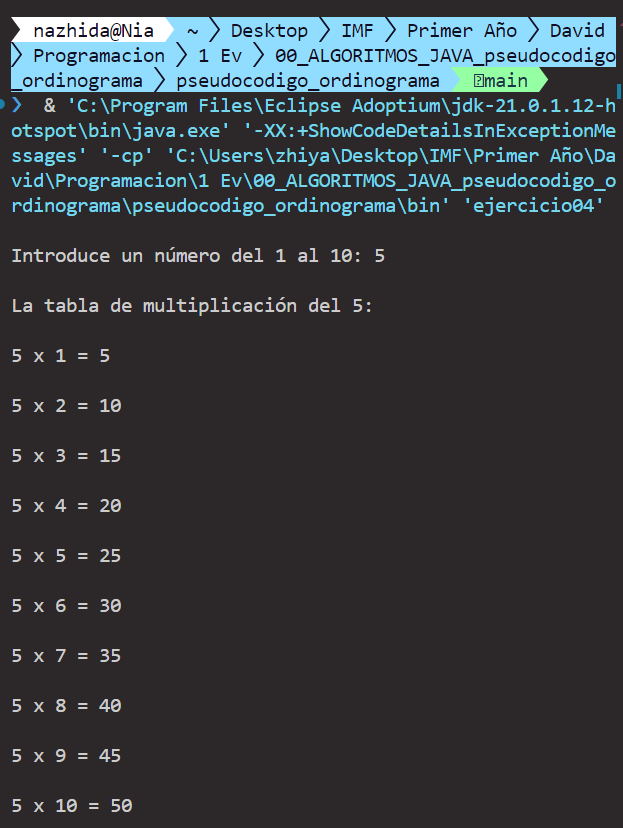 


## Ejercicio 05
### Leer tres números mayores de cero, e imprirmirlos por pantalla ascendente. 

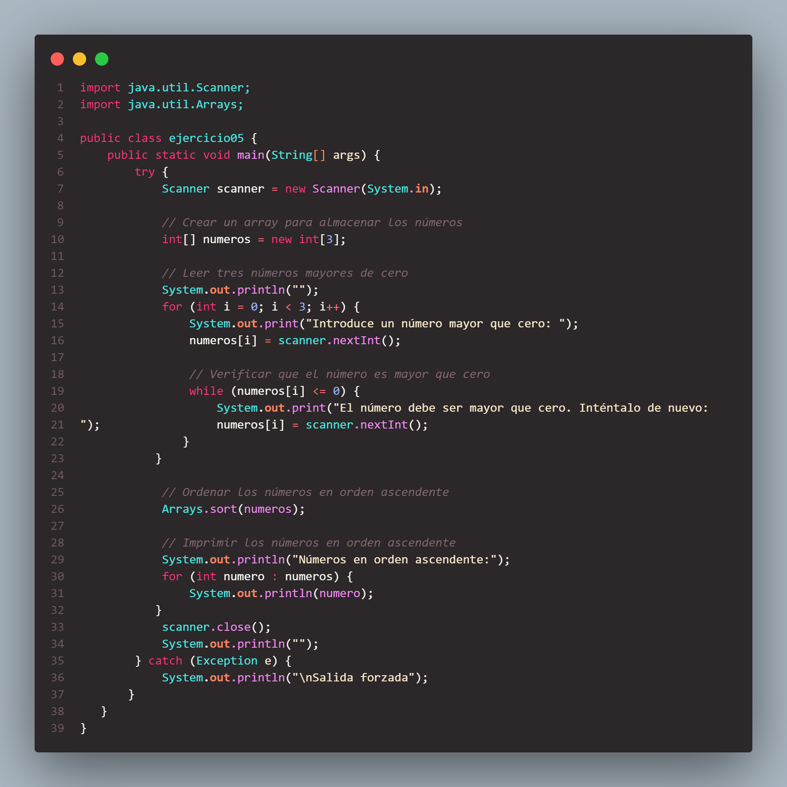
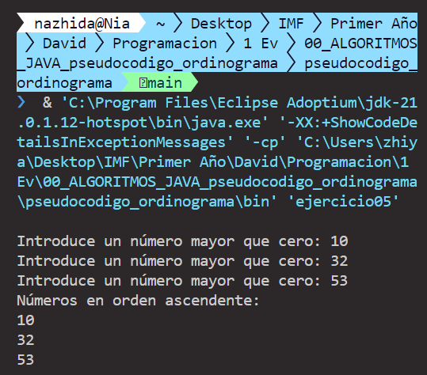 

# Hacer el pseudcódigo, ordinograma, programa en java, de los siguentes enunciados:

## Ejercicio 06
### Leer como datos de entrada un tiempo de forma competa, en horas, minutos y segundos, es decir por ej 16 horas, 20 minutos y 59 segundos. Después sumarle dentro del propio progrmaa 1 segundo, e imprimir el nuevo tiempo obtenido, teniendo en cuenta en el cálculo todos los resultados posibes.

Diagrama de flujo 
```bash
                                                                    +------------------------+
                                                                    |        Inicio          |
                                                                    +------------------------+
                                                                                | 
                                                                                | 
                                                                    +------------------------+
                                                                    | Crear objeto Scanner   |
                                                                    +------------------------+
                                                                                | 
                                                                                | 
                                                                    +--------------------------+
                                                                    | Solicitar entrada del    |
                                                                    | usuario:                 |
                                                                    | - Introduce las horas    |
                                                                    | - Introduce los minutos  |
                                                                    | - Introduce los segundos |
                                                                    +--------------------------+
                                                                                | 
                                                                                | 
                                                                    +------------------------+
                                                                    | Leer horas, minutos,   |
                                                                    | segundos               |
                                                                    +------------------------+
                                                                                | 
                                                                                | 
                                                                    +------------------------+
                                                                    | Incrementar segundos   |
                                                                    +------------------------+
                                                                                | 
                                                                                | 
                                                                    +------------------------+
                                                                    | segundos == 60 ?       |
                                                                    +-----------+------------+
                                                                                | 
                                                                                | 
                                                                    +-----------+-------------+
                                                                    |           |             |
                                                                    |          No             |
                                                                    |           |             |
                                                                    |           |             |
                                                                    |           |             |
                                                                    Sí          |             |
                                                                    |           |             |
                                                        +--------------+        |             |
                                                        | Segundos = 0 |        |             |
                                                        | Minutos++    |        |             |
                                                        +--------------+        |             |
                                                                    |           |             |
                                                                    |           |             |
                                                        +--------------------+  |             |
                                                        |   minutos == 60 ?  |  |             |
                                                        +--------+-----------+  |             |
                                                                 |              |             |
                                                                 |              |             |
                                                                 +--------------+-------------|
                                                                 |              |             |
                                                                 |             No             |
                                                                 |              |             |
                                                                 |              |             |
                                                                 |              |             |
                                                                Sí              |             |
                                                                 |              |             |
                                                     +---------------+          |             |
                                                     | Minutos = 0   |          |             |
                                                     | Horas++       |          |             |
                                                     +---------------+          |             |
                                                              |                 |             |
                                                              |                 |             |
                                                  +---------------------+       |             |
                                                  |     horas == 24 ?   |       |             |
                                                  +-----------+---------+       |             |  
                                                                    +-----------+-------------+
                                                                    |           |             |
                                                                    |           No            |
                                                                    |           |             |
                                                                    |           |             |
                                                                    |           |             |
                                                                   Sí           |             |
                                                                    |           |             |
                                                        +-----------+           |             |
                                                        | Horas = 0 |           |             |
                                                        +-----------+           |             |
                                                                    |           |             |
                                                                    +-----------+-------------+
                                                                                | 
                                                                                | 
                                                                    +--------------------------+
                                                                    | Imprimir tiempo actual:  |
                                                                    | horas, minutos, segundos |
                                                                    +--------------------------+
                                                                                | 
                                                                                | 
                                                                    +------------------------+
                                                                    |     Cerrar Scanner     |
                                                                    +------------------------+
                                                                                | 
                                                                                | 
                                                                    +------------------------+
                                                                    |        Fin             |
                                                                    +------------------------+
```

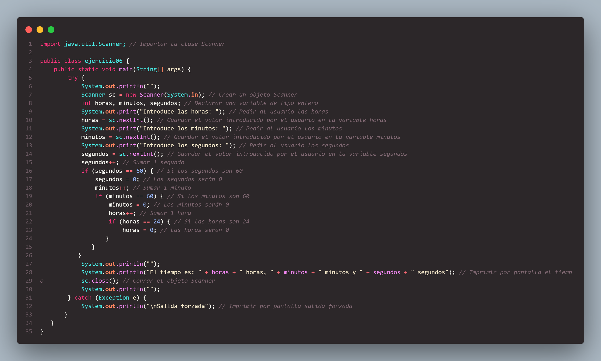
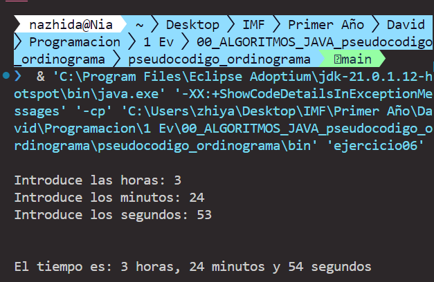

## Ejercicio 07
#### Leer un grupo de números por ej 15 números, que introduzcamos por pantalla e impprimir cantos son positivos, cuántos son negativos y cuántos son 0.

Diagrama de flujo
```bash
                                                                  +------------------------------+
                                                                  |            Inicio            |
                                                                  +------------------------------+
                                                                              | 
                                                                              | 
                                                                  +------------------------------+
                                                                  |   Inicializar Variables:     |
                                                                  |     positivos = 0            |
                                                                  |     negativos = 0            |
                                                                  |     ceros = 0                |
                                                                  +------------------------------+
                                                                              | 
                                                                              | 
                                                                  +------------------------------+
                                                                  |      Bucle (i = 1 a 15)      |
                                                                  +------------------------------+
                                                                              | 
                                                                              | 
                                                                  +------------------------------+
                                                                  |    Entrada del Usuario:      |
                                                                  |   Introduce un número        |
                                                                  +------------------------------+
                                                                              | 
                                                                              | 
                                                                  +------------------------------+
                                                                  |         Leer Número          |
                                                                  |             (num)            |
                                                                  +------------------------------+
                                                                              | 
                                                                              | 
                                                                  +------------------------------+
                                                                  |        num > 0 ?             |
                                                                  +-----------+------------------+
                                                                              | 
                                                                              | 
                                                                    +---------+---------+
                                                                    |                   |
                                                                  Sí                   No
                                                                    |                   |
                                                      +------------+            +------v-------+
                                                      |                         |              num < 0 ? 
                                                      |                         |                  |
                                                      |                         |                  |
                                                      |                         |             +----v----+
                                            +----------v--------+               |             |         |
                                            |  positivos++      |               |             |         No
                                            +-------------------+               |             |         |
                                                                                |             |         |
                                                                      +---------v---------+   |   +-----v-----+
                                                                      |     negativos++   |   |   |   ceros++  |
                                                                      +-------------------+   |   +-----------+
                                                                                              | 
                                                                                              | 
                                                                  +------------------------------+
                                                                  |      Fin del Bucle           |
                                                                  +------------------------------+
                                                                              | 
                                                                              | 
                                                                  +------------------------------+
                                                                  |     Imprimir Resultados:     |
                                                                  |  Números positivos: positivos|
                                                                  |  Números negativos: negativos|
                                                                  |  Números ceros: ceros        |
                                                                  +------------------------------+
                                                                              | 
                                                                              | 
                                                                  +------------------------------+
                                                                  |             Fin              |
                                                                  +------------------------------+
```

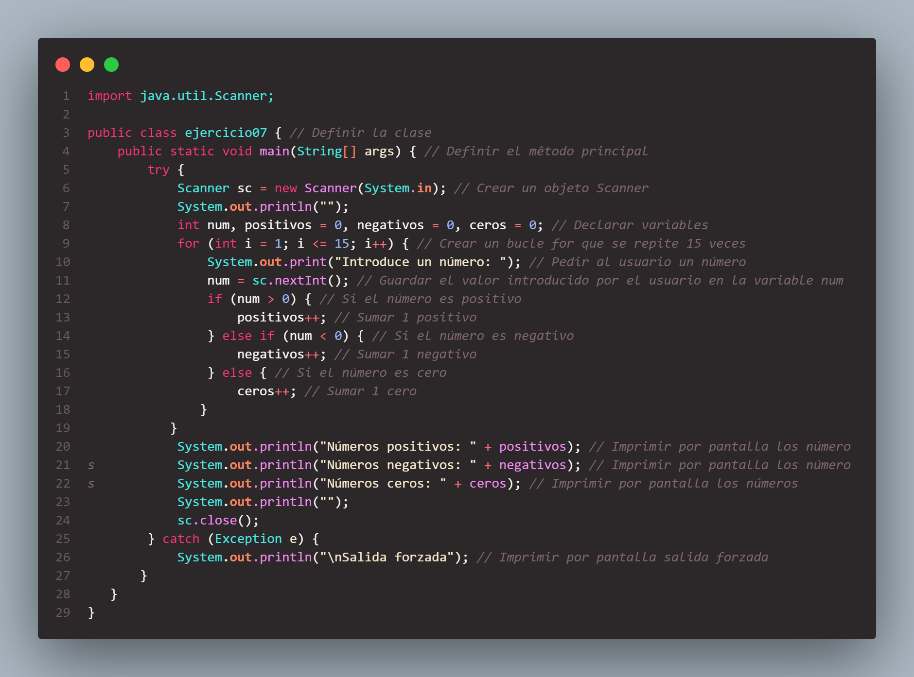
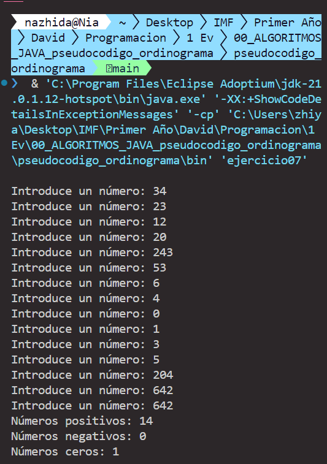

## Ejercicio 08
#### Leer por pantalla una se serie de numeros, que no sean 0. Nuestro bucle termina cuando introduzcamos  el número 0 y sacar el mayor de los números
Diagrama de flujo 
```bash
                                                            +------------------------+
                                                            |        Inicio          |
                                                            +-----------+------------+
                                                                        |
                                                                        v
                                                            +------------------------+
                                                            | Inicializar max a 0    |
                                                            +-----------+------------+
                                                                        |
                                                                        v
                                                            +------------------------+
                                                            | Pedir un número al     |
                                                            | usuario                |
                                                            +-----------+------------+
                                                                        |
                                                                        v
                                                            +------------------------+
                                                            | Leer número introducido|
                                                            +-----------+------------+
                                                                        |
                                                                        v
                                                            +------------------------+
                                                            | ¿Número es 0?          |
                                                            +-----------+------------+
                                                            |           |            |
                                                            | No        | Sí         |
                                                            |           v            |
                                                            |    +----------------+  |
                                                            |    | Mostrar el     |  |
                                                            |    | mayor número   |  |
                                                            |    +----------------+  |
                                                            |           |            |
                                                            |           v            |
                                                            |    +----------------+  |
                                                            |    | Fin            |  |
                                                            |    +----------------+  |
                                                            |                        |
                                                            v                        |
                                                +------------------------+           |
                                                | ¿Número es mayor que   |           |
                                                | max?                   |           |
                                                +-----------+------------+           |
                                                            |                        |
                                                            | No                     |
                                                            v                        |
                                                +------------------------+           |
                                                | Repetir desde el paso 3|           |
                                                +------------------------+           |
                                                            |                        |
                                                            | Sí                     |
                                                            v                        |
                                                +------------------------+           |
                                                | Actualizar max con     |           |
                                                | número introducido     |           |
                                                +------------------------+           |
                                                            |                        |
                                                            v                        |
                                                +-------------------------+          |
                                                | Repetir desde el paso 3 | <--------+
                                                +-------------------------+
```
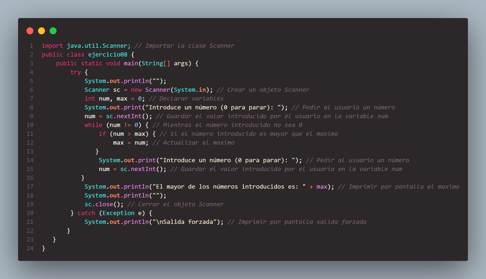
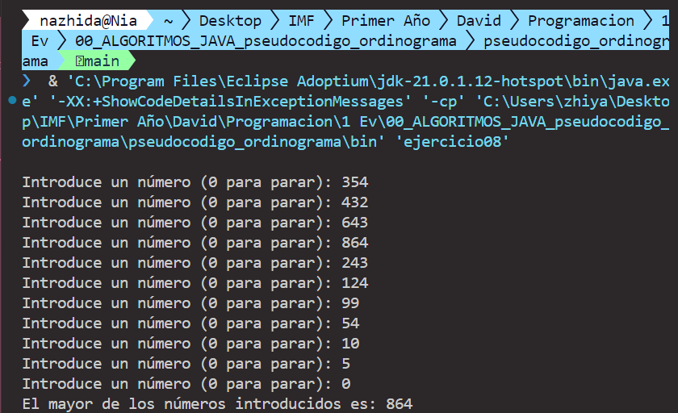 

## Ejercicio 09
#### Leer un número por pantalla, y calcular e imprimir el valor de su función factorial. Recordar que: 
```math
6! = 1 * 2 * 3 * 4 * 5 * 6 = 720
5! = 720
```
Diagrama de flujo 
```bash
                                                  +------------------------+
                                                  |        Inicio          |
                                                  +------------------------+
                                                              | 
                                                  +------------------------+
                                                  | Crear objeto Scanner   |
                                                  +------------------------+
                                                              | 
                                                  +------------------------+
                                                  | Solicitar entrada del  |
                                                  | usuario:               |
                                                  | "Introduce un número"  |
                                                  +------------------------+
                                                              | 
                                                  +------------------------+
                                                  | Leer número introducido|
                                                  | num = sc.nextInt()     |
                                                  +------------------------+
                                                              | 
                                                  +------------------------+
                                                  | Inicializar fact a 1   |
                                                  | int fact = 1           |
                                                  +------------------------+
                                                              | 
                                                  +------------------------+
                                                  | Imprimir " num! = "    |
                                                  +------------------------+
                                                              | 
                                                  +------------------------+
                                                  | Iniciar bucle for      |
                                                  |    for (int i = 1;     |
                                                  |     i <= num; i++)     |
                                                  +------------------------+
                                                              | 
                                                  +------------------------+
                                                  | Multiplicar fact por i |
                                                  |      fact = fact * i   |
                                                  +------------------------+
                                                              | 
                                                  +------------------------+
                                                  |       Imprimir i       |
                                                  +------------------------+
                                                              |  
                                                  +------------------------+
                                                  |        ¿i < num?       |
                                                  +------------+-----------+
                                                               |  
                                            +------------------+--------------------+
                                            |                                       |
                                            |                  No                   |
                                            |                                       | 
                                      +-----------------+                +-----------------------+
                                      | Imprimir " * "  |                | Imprimir " = fact"    |
                                      +-----------------+                +-----------------------+
                                            |                                       | 
                                  +---------------------+             +----------------------------+
                                  | Continuar en        |             | Imprimir resultado final:  |
                                  | el bucle            |             | "El factorial de num es:   |
                                  +---------------------+             | fact"                      |
                                                                      +----------------------------+
                                                                                    | 
                                                                          +-------------------+
                                                                          |   Cerrar Scanner  |
                                                                          |   sc.close()      |
                                                                          +---------+---------+
                                                                                    | 
                                                                          +-------------------+
                                                                          |        Fin        |
                                                                          +-------------------+

```
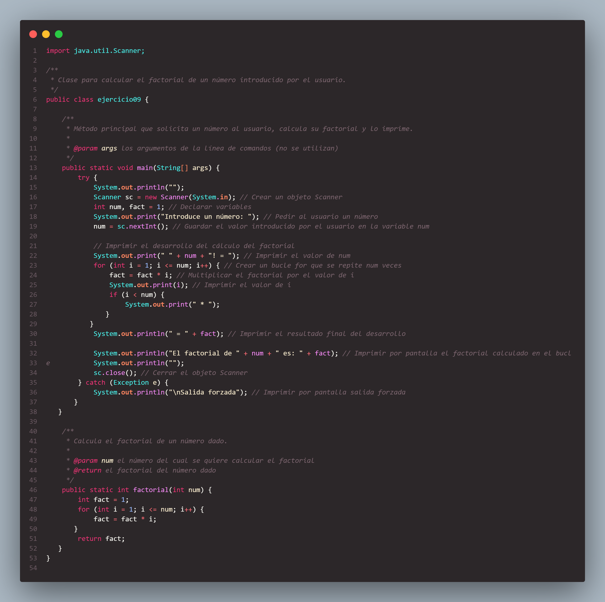
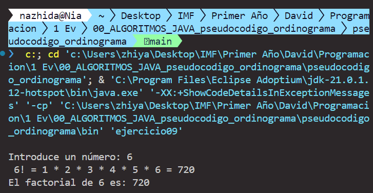

## Ejercicio 10
#### Hacer un prograna que lea una serie de nombres de estudiantes, hasta que queráis. Poned vossotr@s la condición de salida y para cada uno de los estudiantes, lea seis notas. El programa irá el nombre del estudiante con mayor medida, y la nota promedio de todo el grupo

Diagragrama de flujo
```bash
                                                +----------------------------------+
                                                |              Inicio              |
                                                +----------------------------------+
                                                                  |
                                                                  |
                                                +----------------------------------+
                                                | Crear objeto Scanner             |
                                                +----------------------------------+
                                                                  |
                                                                  |
                                                +----------------------------------+
                                                | Inicializar variables:           |
                                                | nombreMaxPromedio = ""           |
                                                | maxPromedio = 0                  |
                                                | sumaNotasTotales = 0             |
                                                | totalEstudiantes = 0             |
                                                +----------------------------------+
                                                                  |
                                                                  |
                                                +----------------------------------+
                                                |          Bucle While             |
                                                |   (infinito)                     |
                                                +----------------------------------+
                                                                  |
                                                                  |
                                                +----------------------------------+
                                                | Solicitar nombre del estudiante  |
                                                | (0 para parar)                   |
                                                +----------------------------------+
                                                                  |
                                                                  |
                                                +----------------------------------+
                                                | Leer nombre                      |
                                                +----------------------------------+
                                                                  |
                                                                  |
                                                +----------------------------------+
                                                | nombre == "0" ?                  |
                                                +------------------+---------------+
                                                                  |
                                                            +---------------------------+
                                                            | No                        | Sí
                                                            |                           |
                                                +-----------+                           |
                                                |                                       | 
                                                |                        +-------------------------+
                                                |                        |   Salir del bucle       |
                                                |                        +-------------------------+
                                                | 
                                    +-------------------------------------+
                                    | Inicializar sumaNotasEstudiante = 0 |
                                    +-------------------------------------+
                                                |
                                                |
                                    +-------------------------------------+
                                    |        Bucle For (i=0; i<6; i++)    |
                                    +-------------------------------------+
                                                |
                                                |
                                    +------------------------------+
                                    |     Solicitar nota           |
                                    +------------------------------+
                                                |
                                                |
                                    +------------------------------+
                                    |      Leer nota               |
                                    +------------------------------+
                                                |
                                                |
                                    +------------------------------+
                                    | sumaNotasEstudiante += nota  |
                                    | sumaNotasTotales += nota     |
                                    +------------------------------+
                                                |
                                                |
                                    +------------------------------+
                                    |        Fin del Bucle For     |
                                    +------------------------------+
                                                |
                                                |
                                    +------------------------------+
                                    | Calcular promedioEstudiante  |
                                    | promedioEstudiante =         |
                                    | sumaNotasEstudiante / 6      |
                                    +------------------------------+
                                                |
                                                |
                                    +------------------------------+
                                    | Incrementar totalEstudiantes |
                                    +------------------------------+
                                                |
                                                |
                                    +-----------------------------------------+
                                    |     promedioEstudiante > maxPromedio ?  |
                                    +-----------------------+-----------------+     
                                                            |
                                                            +------------------------+                  
                                                            | No                     | Sí
                                                +-----------+                        |
                                                |                                    |
                                                |                                    |
                                                |                        +----------------------------------+
                                                |                        | maxPromedio = promedioEstudiante |
                                                |                        | nombreMaxPromedio = nombre       |
                                                |                        +----------------------------------+
                                                |
                                                |
                                    +------------------------------+
                                    |      Fin del Bucle While     |
                                    +------------------------------+
                                                |
                                                |
                                    +------------------------------+
                                    | totalEstudiantes > 0 ?       |
                                    +------------------------------+
                                                            +------|---------------------+
                                                            | No                         | Sí
                                                            |                            |
                                                +-----------+                            |
                                                |                                        | 
                                                |                        +-----------------------------------+
                                                |                        |  Imprimir resultados finales:     |
                                                |                        |  - Estudiante con mejor promedio  |
                                                |                        |  - Promedio total de notas        |
                                                |                        |  - Número total de estudiantes    |
                                                |                        +-----------------------------------+
                                                |                                        |
                                                |                                        |
                                                |                        +----------------------------------+
                                                |                        | Imprimir: No se ingresaron notas |
                                                |                        +----------------------------------+
                                                |
                                                |
                                +------------------------------+
                                |              Fin             |
                                +------------------------------+ 
```

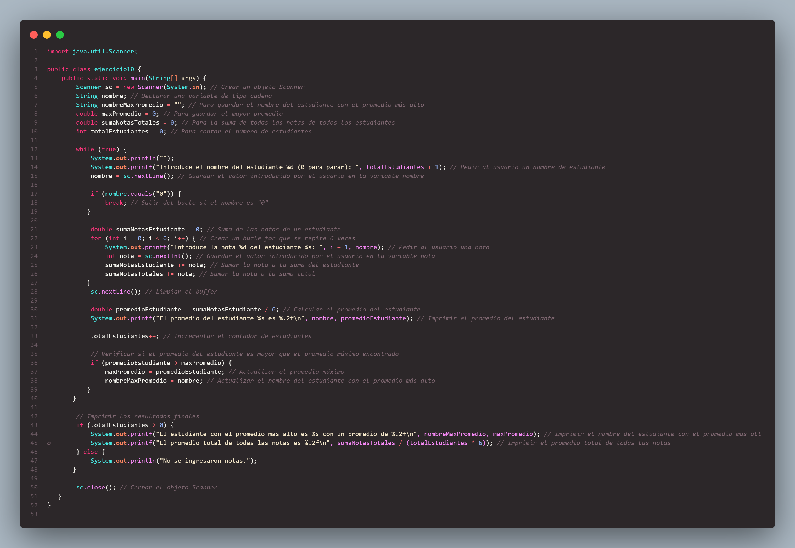
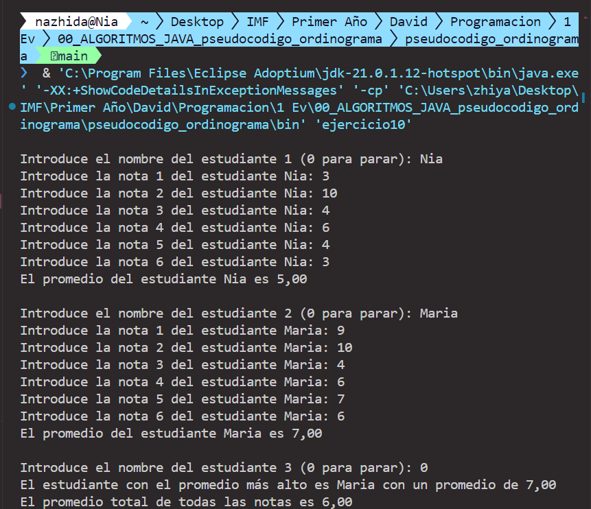