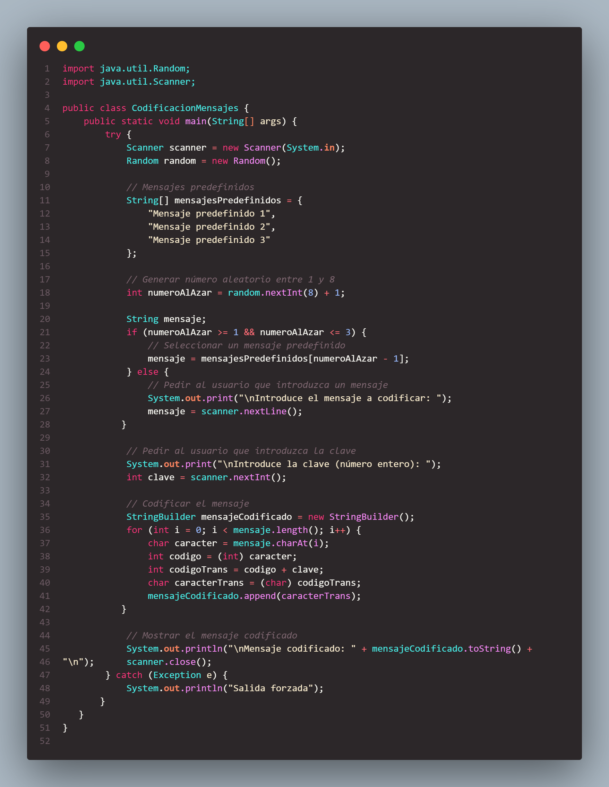
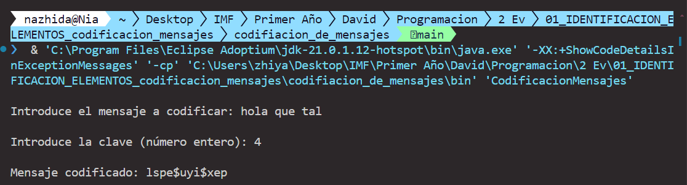

# Codificación de Mensajes en Java

Este proyecto implementa un programa en Java para codificar mensajes utilizando una clave proporcionada por el usuario. Dependiendo de un número aleatorio generado, el programa seleccionará un mensaje predefinido o pedirá al usuario que introduzca uno.

## Funcionalidades

- **Generación de número aleatorio**: El programa genera un número aleatorio entre 1 y 8.
- **Mensajes predefinidos**: Si el número generado es 1, 2 o 3, se selecciona uno de los mensajes predefinidos.
- **Entrada del usuario**: Si el número generado es 4, 5, 6, 7 o 8, se solicita al usuario que introduzca un mensaje.
- **Codificación del mensaje**: El mensaje se codifica sumando una clave (entero) a cada carácter del mensaje. 

### Codigo
#### 
### Resultado
#### 