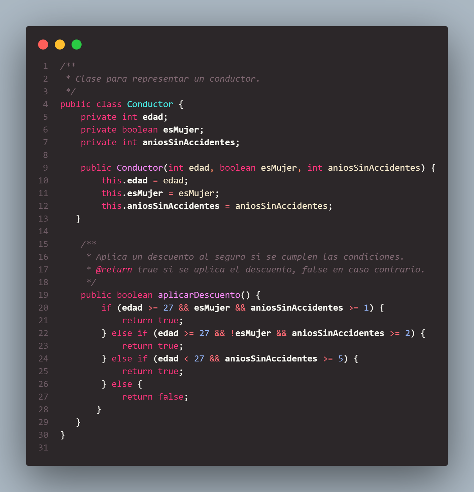
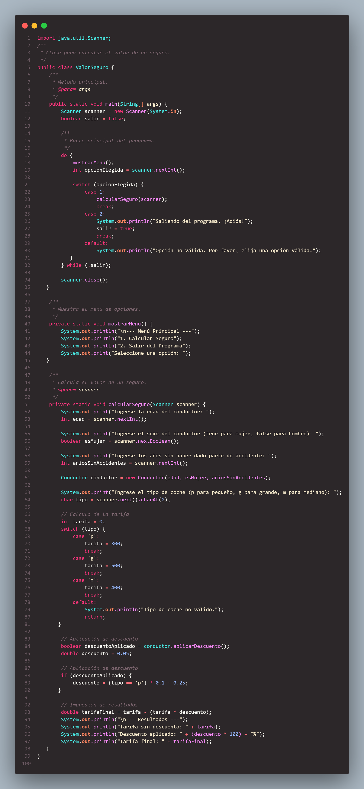
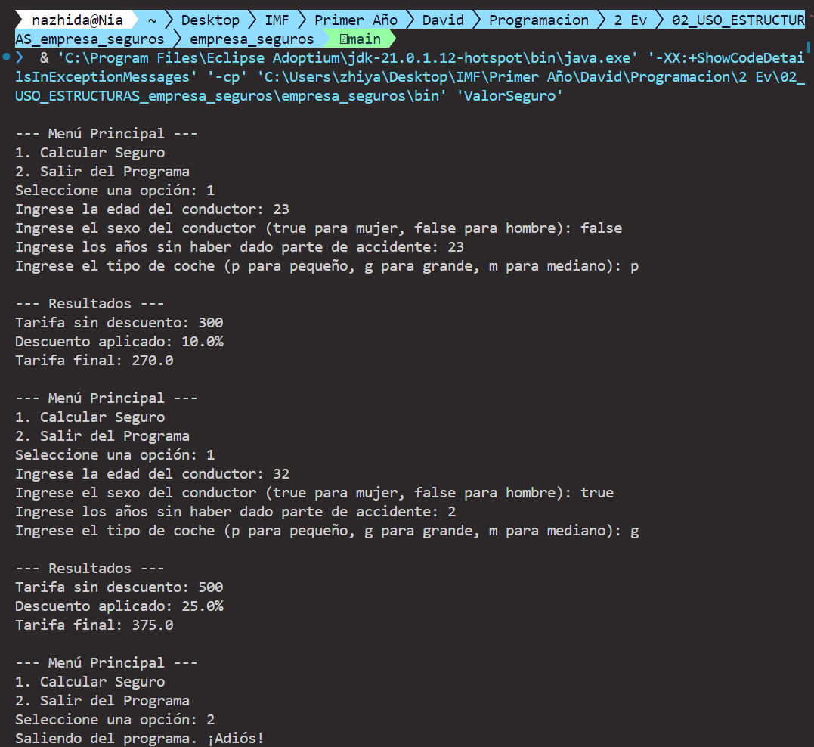

# ValorSeguro

## Descripción
Este programa permite calcular el descuento aplicable a la tarifa de seguro de coche de un conductor, basado en ciertos criterios. Los descuentos se aplican dependiendo de la edad, el sexo y los años sin haber dado parte de accidente del conductor.

## Uso
### Clase `Conductor`
La clase `Conductor` tiene los siguientes atributos:
- `edad`: int
- `esMujer`: boolean
- `aniosSinAccidentes`: int

Método:
- `aplicarDescuento()`: Devuelve `true` si el conductor califica para un descuento, `false` en caso contrario.

### Clase principal `ValorSeguro`
La clase `ValorSeguro` contiene el método `main` que:
1. Solicita al usuario los datos del conductor.
2. Determina la tarifa base dependiendo del tipo de coche (`p` para pequeño, `g` para grande, `m` para mediano).
3. Aplica el descuento si el conductor cumple con los criterios.
4. Muestra la tarifa sin descuento, el descuento aplicado y la tarifa final.

### Codigos
#### Conductor
#####  
##### ValorSeguro
####  
### Resultado
#### 