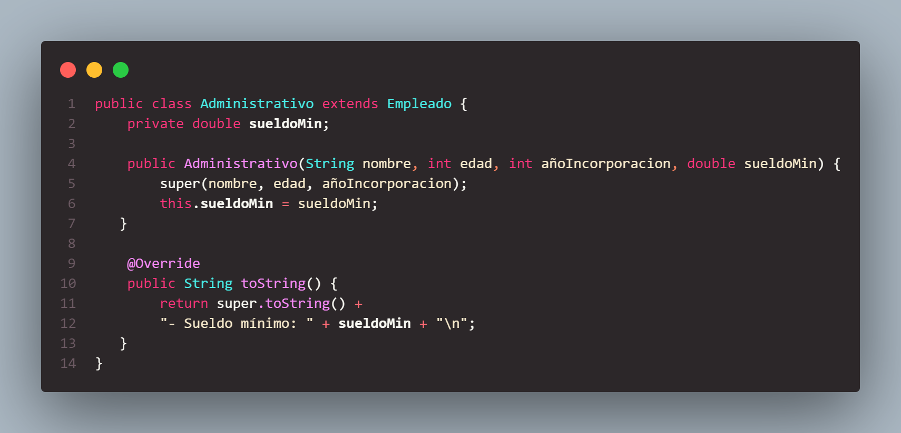

# Gestión de Empleados

Este proyecto en Java gestiona una lista de empleados, incluyendo administrativos e informáticos, utilizando herencia y clases.

## Clases

### Empleado
Clase base que contiene los atributos comunes a todos los empleados:
- `nombre`
- `edad`
- `añoIncorporacion`
- `SUBIDA` (constante utilizada en cálculos)

Métodos:
- Constructor
- Getters y setters
- `toString`

### Administrativo
Clase que hereda de `Empleado` y añade:
- `sueldoMin` (sueldo mínimo)

Métodos:
- Constructor
- `sueldoReal` (calcula el sueldo real basado en los trienios trabajados y la constante `SUBIDA`)
- `toString` (incluye el sueldo real)

### Informatico
Clase que hereda de `Empleado` y añade:
- `sueldoMin` (sueldo mínimo)
- `proyectos` (número de proyectos)

Métodos:
- Constructor
- `sueldoReal` (calcula el sueldo real basado en los trienios trabajados, la constante `SUBIDA` y un plus si el número de proyectos es mayor que 2)
- `toString` (incluye el sueldo real)

### ArrayListPrincipal
Clase principal que gestiona un `ArrayList` de empleados.

Métodos:
- `cargarEmpleados` (carga empleados predefinidos en la lista)
- `crearEmpleados` (crea empleados a través de la entrada del usuario)
- `mostrarEmpleados` (muestra todos los empleados)
- `mostrarRangoEdad` (muestra empleados en un rango de edad específico)
- `buscarMasAntiguo` (busca y devuelve el empleado más antiguo)
- `mostrarOrdenadosPorAñoIncorporacion` (muestra los empleados ordenados por año de incorporación)

### Codigos
#### Administrativo
##### 
#### Informatico
##### 
#### Empleado
##### 
#### ArrayListPrincipal
##### 
### Resultado
#### 1. Crear empleado
#####   
#### 2. Mostrar empleados
#####   
#### 3. Mostrar empleados en rango de edad
#####   
#### 4. Buscar empleado más antiguo
#####   
#### 5. Mostrar empleados ordenados por año de incorporación
#####   
#### 6. Salir
#####   