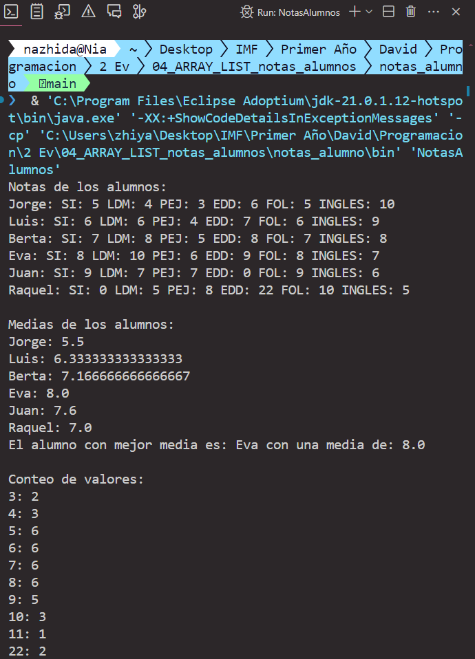

# Notas de Alumnos - Gestión de Calificaciones

## 📚 Descripción

Este programa en Java permite gestionar las notas de los alumnos de un curso específico. Utiliza una matriz bidimensional para almacenar las notas de los alumnos en diferentes módulos. Además, proporciona métodos para mostrar las notas, calcular las medias y contabilizar la frecuencia de las notas.

### Codigo
#### 
### Resultado
#### 
