# Proyecto de Gestión de Multimedia

Este proyecto es una aplicación de consola en Java para gestionar objetos multimedia, como películas y álbumes. Permite agregar, buscar, mostrar y eliminar estos objetos en una colección.

## Estructura del Proyecto

El proyecto incluye las siguientes clases:

- **Multimedia**: Clase base para objetos multimedia, con atributos comunes como título, autor, formato, duración y precio.
- **Pelicula**: Clase derivada de `Multimedia` para representar películas. Incluye atributos adicionales como actor principal, actriz principal y si es un estreno.
- **Album**: Clase derivada de `Multimedia` para representar álbumes de música. Incluye atributos adicionales como número de canciones y año de lanzamiento.
- **ArrayMultimedia**: Clase para gestionar un array de objetos `Multimedia`. Permite añadir, buscar y eliminar objetos del array.
- **PrincipalArray**: Clase principal con el método `main` que contiene un menú interactivo para gestionar los objetos multimedia.

# Imgágenes del codigo

## Album

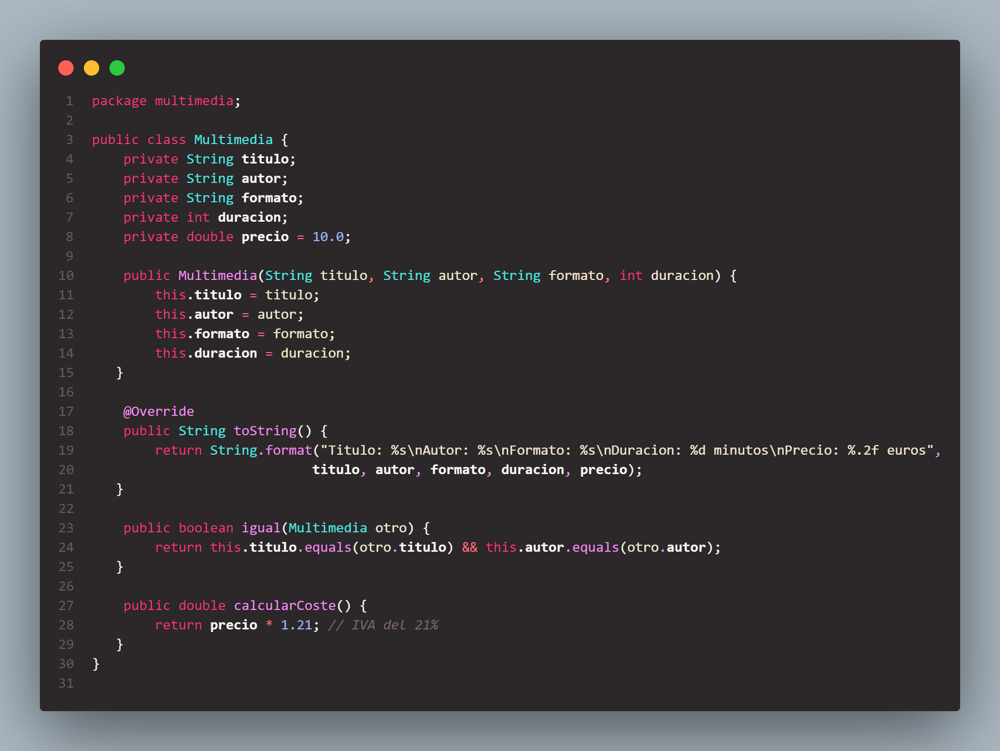 

## ArrayMultimedia
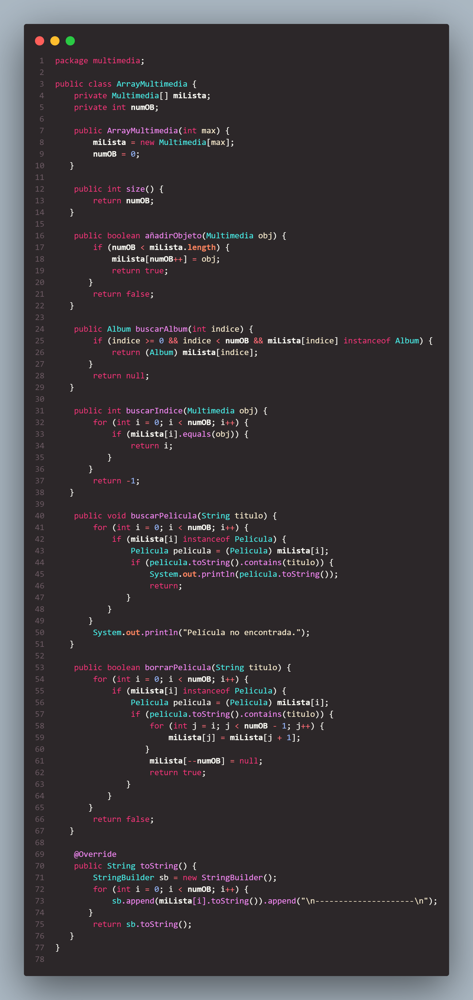 

## MiInterfaz 
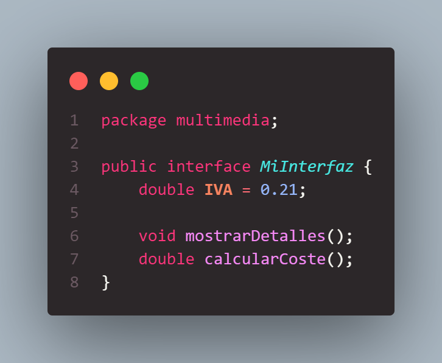 

## Multimedia 
 

## Pelicula 
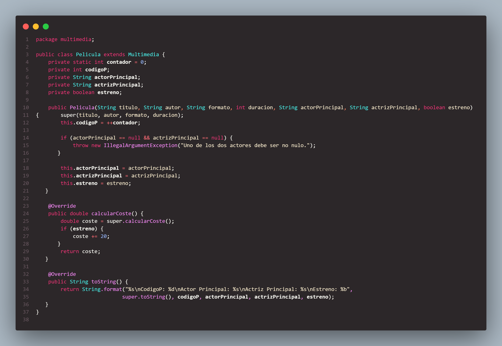 

## PrincipalArray 
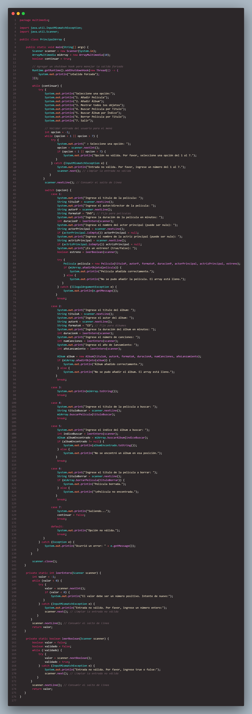 

## Resoulucion usando las opciones de menu
## Respuesta 1
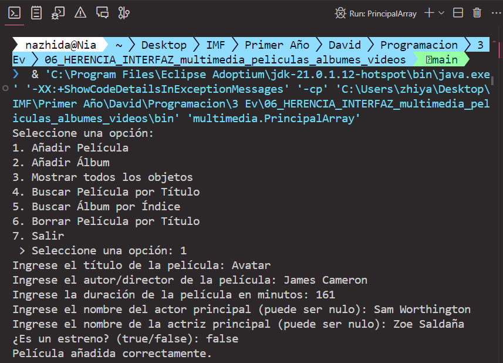
## Respuesta 2
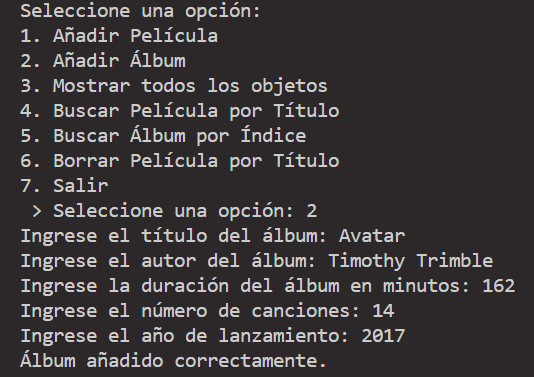
## Respuesta 3
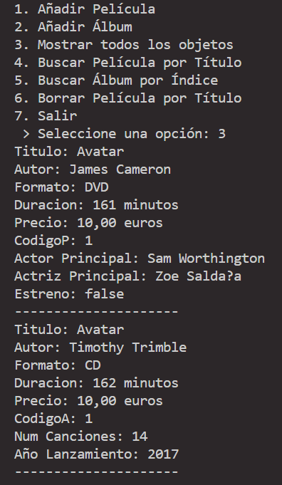
## Respuesta 4
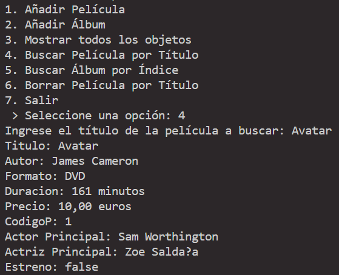
## Respuesta 5
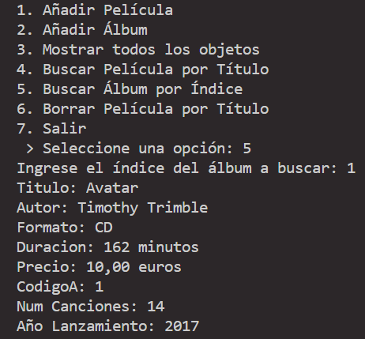
## Respuesta 6
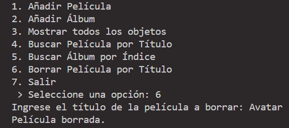
## Respuesta 7
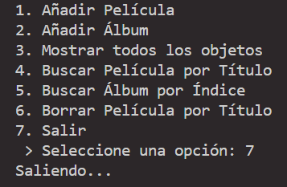 