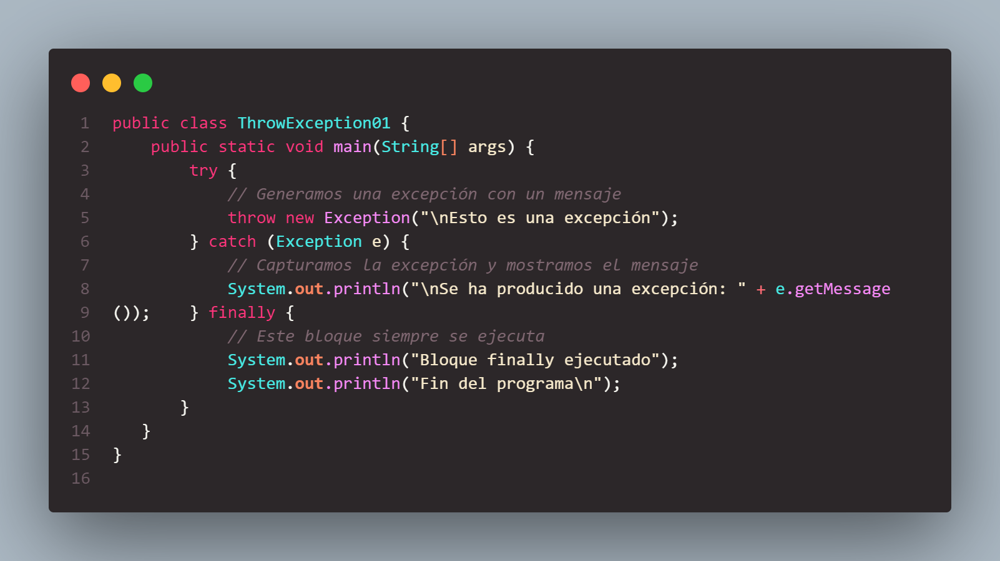
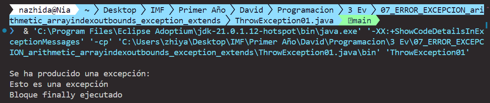
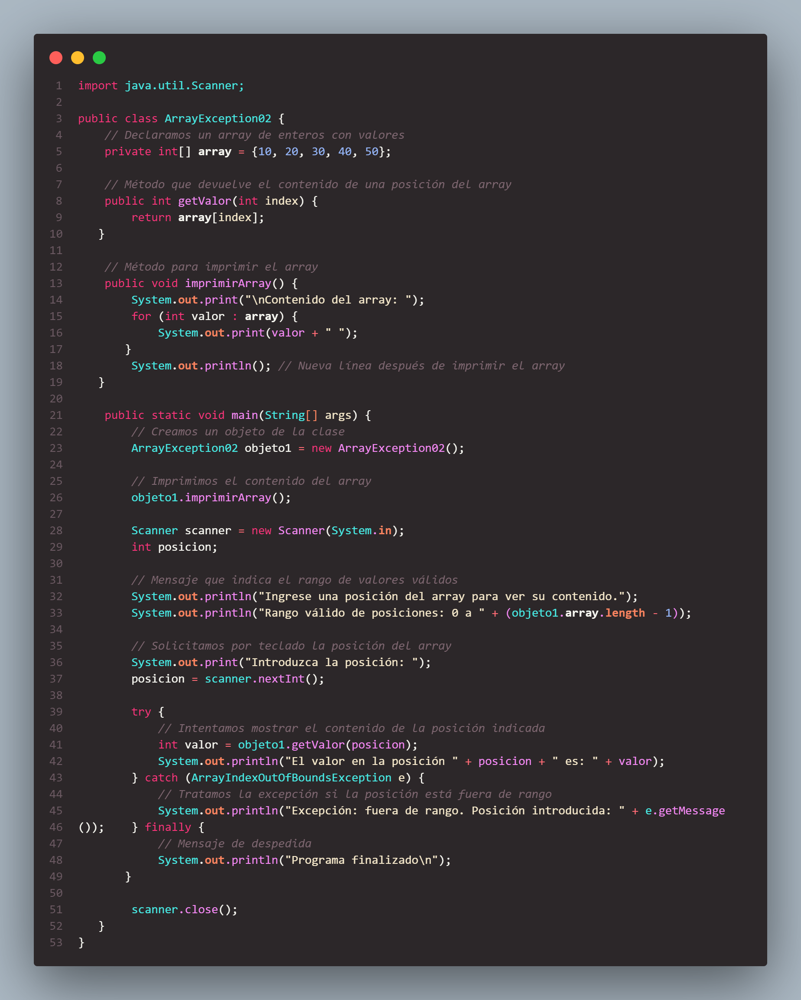
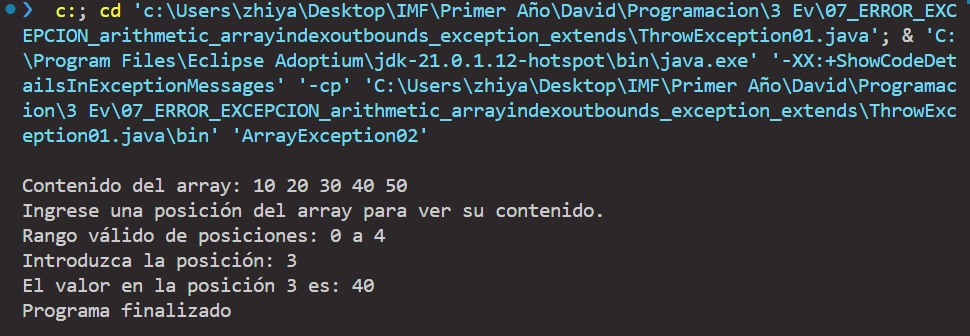
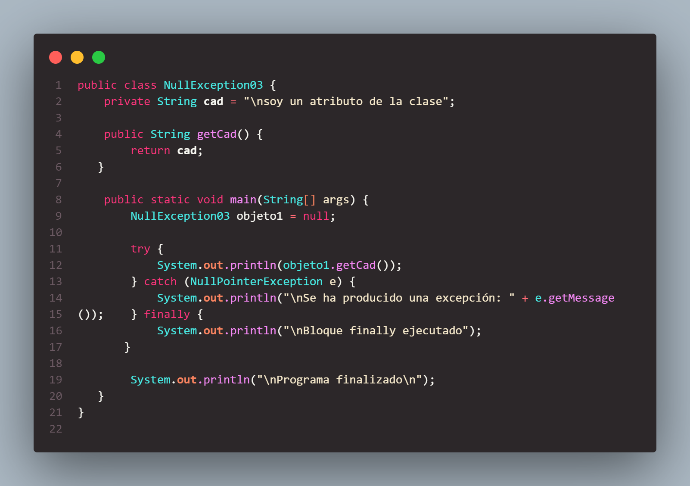
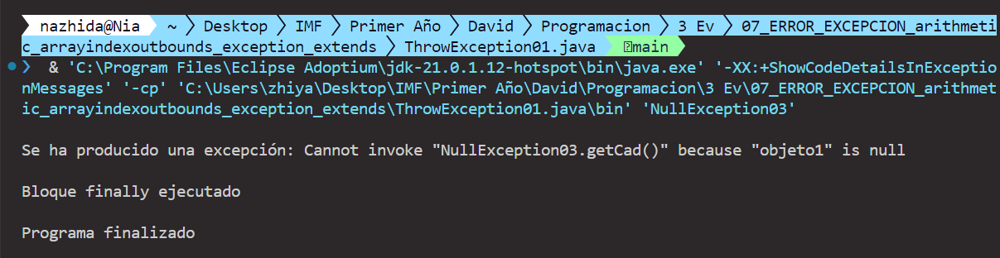
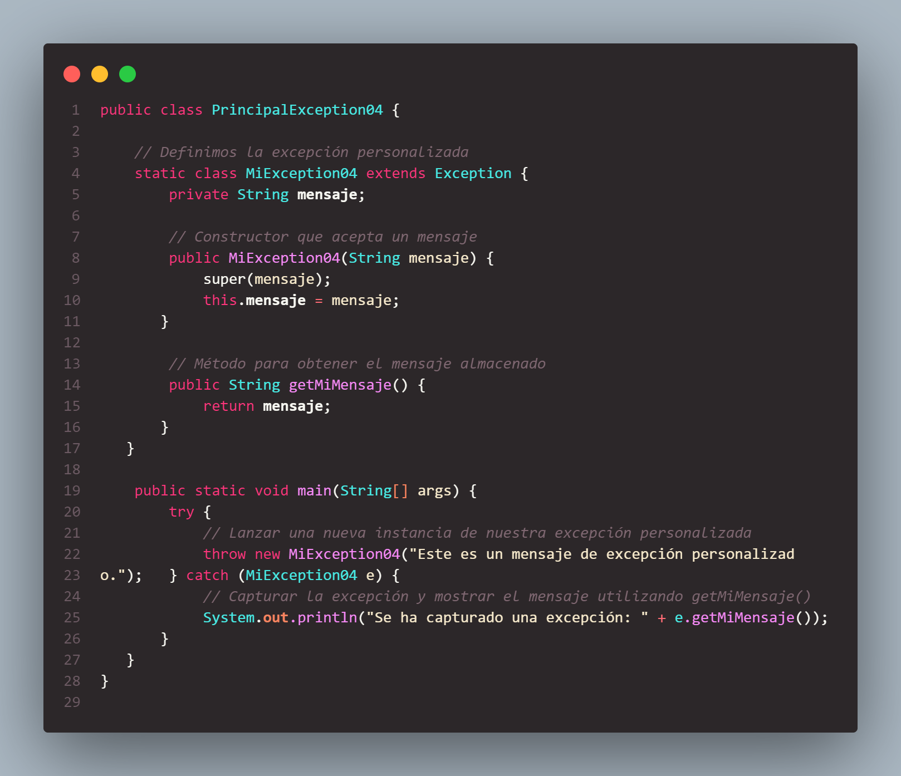
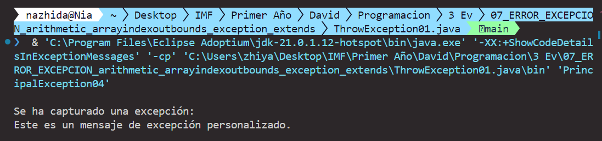

# Ejercicios

## EJ1 - ThrowException01

Este proyecto Java es un ejemplo básico de cómo generar y manejar excepciones. El objetivo es mostrar el uso de los bloques `try`, `catch` y `finally` en Java para manejar condiciones excepcionales de manera efectiva.

### Descripción

El programa `ThrowException01` lanza una excepción intencionalmente y luego la captura y maneja, imprimiendo mensajes específicos en la consola para cada parte del flujo de manejo de excepciones.

### Contenido

- `ThrowException01.java`: Archivo de código fuente que contiene el programa principal.

#### Codigo
##### 
#### Resultado
##### 

## EJ2 - ArrayException02 

Este proyecto Java es un ejemplo básico de cómo manejar excepciones de tipo `ArrayIndexOutOfBoundsException`. El objetivo es mostrar el uso de los bloques `try`, `catch` y `finally` en Java para manejar condiciones excepcionales de manera efectiva cuando se trabaja con arrays.

### Descripción

El programa `ArrayException02` solicita al usuario que introduzca un índice para acceder a un valor en un array. Si el índice está fuera de los límites del array, se lanza una excepción `ArrayIndexOutOfBoundsException`, que es capturada y manejada adecuadamente.

### Contenido

- `ArrayException02.java`: Archivo de código fuente que contiene el programa principal.

##### Codigo
######   
##### Resultado
######  
## EJ3 - NullException03 

Este proyecto Java es un ejemplo básico de cómo manejar excepciones de tipo `NullPointerException`. El objetivo es mostrar el uso de los bloques `try`, `catch` y `finally` en Java para manejar condiciones excepcionales de manera efectiva.

### Descripción

El programa `NullException03` intenta acceder a un método de un objeto que es `null`, lo que provoca una `NullPointerException`. Esta excepción es capturada y manejada, imprimiendo mensajes específicos en la consola para cada parte del flujo de manejo de excepciones.

### Contenido

- `NullException03.java`: Archivo de código fuente que contiene el programa principal.

##### Codigo
######  
##### Resultado
######  

##  EJ4 - PrincipalException04
Este proyecto Java es un ejemplo de cómo definir y utilizar excepciones personalizadas. El objetivo es mostrar cómo crear una excepción personalizada, lanzarla y manejarla adecuadamente.

### Descripción

El programa `PrincipalException04` define una excepción personalizada llamada `MiException04`. Esta excepción se lanza intencionalmente en el bloque `try` y se captura en el bloque `catch`, mostrando un mensaje personalizado en la consola.

### Contenido

- `PrincipalException04.java`: Archivo de código fuente que contiene el programa principal y la definición de la excepción personalizada.

#### Codigo
###### 
#### Resultado
######  