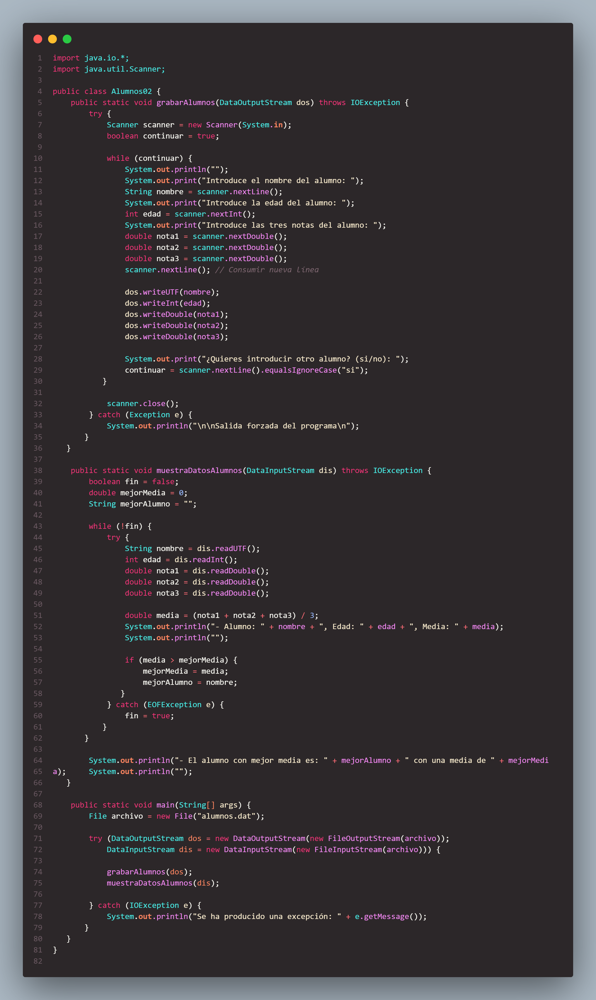

# EJERCICIOS

## EJ 1 - Tabla01

Este proyecto Java es un ejemplo de cómo generar y leer archivos de texto utilizando `FileWriter` y `FileReader`. El objetivo es mostrar cómo crear una tabla de multiplicar para un número dado y guardar esta tabla en un archivo, así como leer y mostrar el contenido del archivo.

### Descripción

El programa `Tabla01` permite al usuario introducir un número para generar su tabla de multiplicar. La tabla se guarda en un archivo de texto y luego se lee y muestra su contenido en la consola.

### Contenido

- `Tabla01.java`: Archivo de código fuente que contiene el programa principal y los métodos para grabar y leer la tabla de multiplicar.

#### Codigo 
##### 
#### Resultado
##### 
##### 
##### 

## Ej 2 - Alumnos02
Este proyecto Java es un ejemplo de cómo leer y escribir datos binarios utilizando `DataOutputStream` y `DataInputStream`. El objetivo es mostrar cómo guardar información sobre alumnos en un archivo y luego leerla para calcular la media de sus notas.

### Descripción

El programa `Alumnos02` permite al usuario introducir datos sobre varios alumnos (nombre, edad y tres notas) y guarda estos datos en un archivo binario llamado `alumnos.dat`. Luego, lee los datos del archivo, muestra la información de cada alumno y calcula cuál alumno tiene la mejor media de notas.

### Contenido 
- `Alumnos02.java`: Archivo de código fuente que contiene el programa principal y los métodos para grabar y mostrar los datos de los alumnos.

#### Codigo
##### 
#### Resultado
##### 

## EJ 3 - Palabras03
Este proyecto Java es un ejemplo de cómo leer una frase del usuario y escribirla en un archivo de texto. El objetivo es mostrar cómo manejar entradas de usuario, manipular cadenas y trabajar con archivos en Java.

### Descripción

El programa `Palabras03` permite al usuario introducir una frase. La frase se guarda en un archivo de texto en una carpeta especificada. Si la carpeta no existe, el programa la crea.

### Contenido

- `Palabras03.java`: Archivo de código fuente que contiene el programa principal y el método para escribir la frase en un archivo.

## EJ 4 - Html04

Este proyecto Java es un ejemplo de cómo generar un archivo HTML dinámicamente utilizando `FileWriter`. El objetivo es mostrar cómo recopilar datos del usuario y usarlos para crear una página HTML personalizada con varias secciones.

### Descripción

El programa `PrincipalHTML` permite al usuario introducir varios datos que se utilizan para generar una página HTML. La página puede incluir varias secciones, con opciones para duplicar estas secciones con diferentes colores de fondo.

### Contenido

- `PrincipalHTML.java`: Archivo de código fuente que contiene el programa principal y los métodos para leer los datos del usuario y generar el archivo HTML.

#### Codigo
##### 
#### Resultado
##### 
##### 
##### 

#### Codigo
##### 
#### Resultado
##### 
##### 
##### 
#####  

